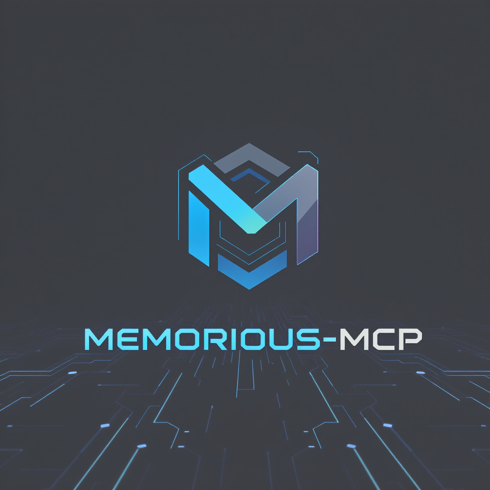

# memorious-mcp



A **100% local & private** semantic memory MCP (Model Context Protocol) server for AI assistants. Built with ChromaDB for vector similarity search and [FastMCP 2](https://gofastmcp.com/). **Runs entirely locally** - no data ever leaves your machine.

## Overview

memorious-mcp provides AI assistants with long-term memory capabilities through three core operations: `store`, `recall`, and `forget`. It uses ChromaDB's vector database to enable semantic similarity search, allowing assistants to retrieve relevant memories even when the exact wording differs from the original storage. **All processing and storage happens locally on your machine** - no data ever leaves your machine, ensuring complete privacy and security.

## Key Features

- **100% Local & Private**: All data processing and storage happens on your machine - nothing goes to the cloud
- **Persistent Memory**: Data persists across sessions using ChromaDB's disk-based storage
- **Semantic Search**: Vector embeddings enable similarity-based memory retrieval
- **Simple API**: Three intuitive tools for memory management
- **FastMCP Integration**: Built on FastMCP for efficient MCP server implementation
- **Canonical Key Design**: Optimized for short, embedding-friendly keys (1-5 words)
- **Secure by Design**: No external API calls or cloud dependencies required

## Tools

### `store`
Store facts, preferences, or information with short canonical keys optimized for vector similarity.

**Parameters:**
- `key` (string): Short, canonical key (1-5 words, space-separated)
- `value` (string): The actual information to store

### `recall`
Retrieve stored memories using semantic similarity search.

**Parameters:**
- `key` (string): Query key for similarity search
- `top_k` (int, default: 3): Maximum number of results to return

### `forget`
Delete memories matching a query key.

**Parameters:**
- `key` (string): Query key to find memories to delete
- `top_k` (int, default: 3): Number of nearest matches to consider

## Installation

```bash
# Install via uvx (recommended)
uvx memorious-mcp

# Or install in virtual environment
uv sync
uv run memorious-mcp
```

## Configuration

Add to your MCP client configuration:

```json
{
  "mcpServers": {
    "memorious": {
      "command": "uvx",
      "args": ["memorious-mcp"]
    }
  }
}
```

For development/local installation:
```json
{
  "mcpServers": {
    "memorious": {
      "command": "uv",
      "args": ["run", "memorious-mcp"],
      "cwd": "/path/to/memorious-mcp"
    }
  }
}
```

## Use Cases

- **Personal Assistant Memory**: Remember user preferences, habits, and personal information
- **Context Preservation**: Maintain conversation context across sessions
- **Knowledge Management**: Store and retrieve project-specific information
- **Personalization**: Enable AI assistants to provide personalized responses based on stored preferences
- **Privacy-First AI**: Keep sensitive personal data local while still having persistent memory

## Claude CLI Configuration

To add memorious-mcp to Claude CLI, use the following commands:

```bash
# Add the MCP server using uvx (recommended)
claude mcp add memorious-mcp uvx memorious-mcp

# Alternative: for development/local installation
claude mcp add memorious-mcp uv run memorious-mcp --cwd /path/to/memorious-mcp
```

You can then list your configured MCP servers:
```bash
claude mcp list
```

And remove the server if needed:
```bash
claude mcp remove memorious-mcp
```

## Example Tool Signatures
- `store(key: str, value: str) -> {"id": str}`
- `recall(key: str, top_k: int = 3) -> {"results": [...]}` where each result includes id, key, value, distance, timestamp
- `forget(key: str, top_k: int = 3) -> {"deleted_ids": [...]}`

## Testing

Run tests with:

```bash
# Using uv
uv run python -m pytest tests/ -v

# Or if pytest is available globally
pytest tests/ -v
```

## Technical Details

- **Backend**: ChromaDB with persistent disk storage
- **Embeddings**: Uses ChromaDB's default embedding function (local processing)
- **Storage Location**: `./.memorious` directory (configurable)
- **Python Version**: Requires Python ≥3.12
- **License**: MIT
- **Privacy**: No network requests, no cloud dependencies, all data stays local

## Package Structure

The project follows the standard Python package layout:

```
memorious-mcp/
├── src/
│   └── memorious_mcp/
│       ├── __init__.py
│       ├── main.py                 # MCP server entry point
│       └── backends/
│           ├── __init__.py
│           ├── memory_backend.py   # Abstract base class
│           └── chroma_backend.py   # ChromaDB implementation
├── tests/
│   └── test_chroma_backend.py      # Integration tests
├── pyproject.toml                  # Package configuration
└── README.md
```

The server is designed for local/CLI integrations using stdio transport, making it suitable for personal AI assistants and development workflows where privacy and data security are paramount.

## Contributing

Contributions are welcome. Open a PR with tests.
